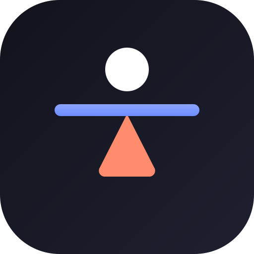

  

<h1 align="center">Точка Опоры</h1>

  <strong>Пошаговая система выхода из ПППГ</strong> 
  <em>Персистирующее постурально-перцептивное головокружение (PPPD)</em>

  
  

  
  
  
  

---

## 📖 О книге

**«Точка Опоры»** — книга для людей с **ПППГ** (Persistent Postural-Perceptual Dizziness), написанная человеком, который сам прошёл через полугодовой ад шаткости, дереализации и тревоги — и **полностью выздоровел**.

Это не теоретическая монография. Это **инженерная инструкция** из 33 глав и 5 модулей, построенная на доказательных терапевтических протоколах.

---

## 📚 Структура книги

| # | Модуль | Что внутри | Доступ |
|---|--------|------------|--------|
| 0 | **База** | Что такое ПППГ, какие обследования пройти, тесты HADS/DHI | 🟢 Бесплатно |
| 1 | **Тело** | Мышечный панцирь, релаксация Джекобсона, вестибулярная гимнастика, нейрофизиология, зрительная зависимость, сон | 🟢 Бесплатно |
| 2 | **Батарейка** | Адреналиновая петля, CAS, ипохондрия, экспозиция, спорт, вестибулярная мигрень, дереализация | 🔒 По ключу |
| 3 | **Мышление** | Нейропластичность, метакогнитивная терапия, когнитивные искажения, корневые причины, эго, внутренний ребёнок, подавленные эмоции | 🔒 По ключу |
| 4 | **Выход** | Анатомия отката, стратегия «Шторм», новая личность, близкие и ПППГ | 🔒 По ключу |

Первые **12 глав бесплатны** — без регистрации и без ограничений.

---

## 🧠 Что такое ПППГ?

**ПППГ** (МКБ-11: AB32.0) — хроническое функциональное расстройство нервной системы. Человек постоянно ощущает шаткость, неустойчивость и головокружение, хотя все обследования в норме.

ПППГ — **вторая по частоте** причина обращений к отоневрологам после ДППГ. Диагностируется у 15–20% пациентов вестибулярных клиник.

**ПППГ излечимо.** Книга объединяет пять направлений доказательной медицины:

1. 🏋️ Вестибулярная реабилитация
2. 🧩 Когнитивно-поведенческая терапия (КПТ)
3. 🎯 Экспозиция
4. 🏃 Физическая активность
5. 💊 Фармакотерапия (СИОЗС)

---

## ✨ Возможности сайта

- 🌗 **Тёмная / светлая тема** с автосохранением
- 📊 **Прогресс-бар** чтения
- 📱 **Адаптивный дизайн** — мобильные, планшеты, десктоп
- 📄 **PDF-экспорт** глав для офлайн-чтения
- ⚡ **Lighthouse**: Performance 95+, Accessibility 100, SEO 100

---

## 🔗 Ссылки

| | |
|---|---|
| 🌐 **Читать** | [hmjim.github.io/pppd](https://hmjim.github.io/pppd/) |
| 💬 **Telegram-группа** | [@pppd_vertigo](https://t.me/pppd_vertigo) |
| ✉️ **Автор** | [@Hmjim](https://t.me/Hmjim) |

---

## 📝 Лицензия

Все права на контент книги «Точка Опоры» принадлежат автору.  
Воспроизведение, распространение и перепродажа без письменного согласия запрещены.

---

  © 2026 Максим · Книга «Точка Опоры» — пошаговая система выхода из ПППГ

